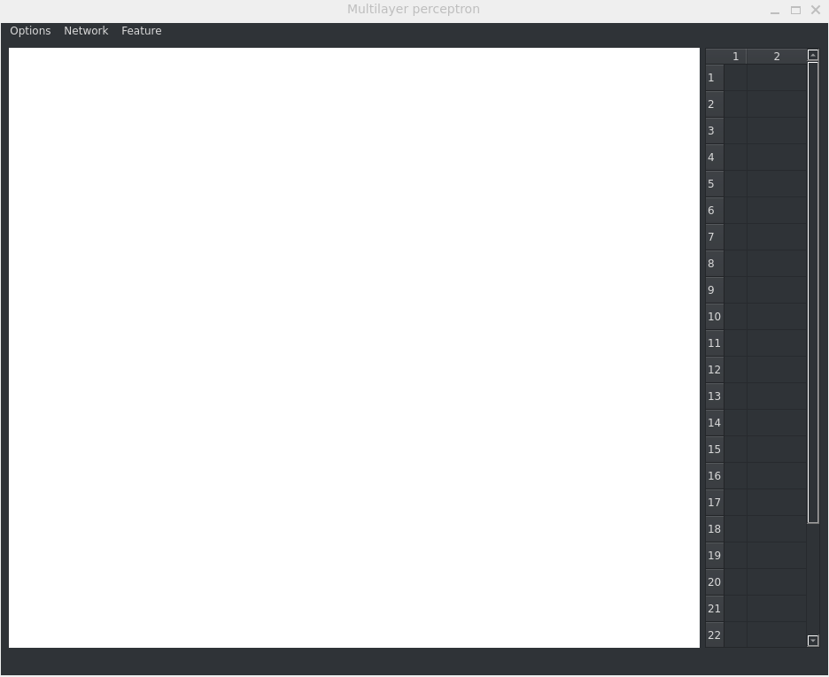
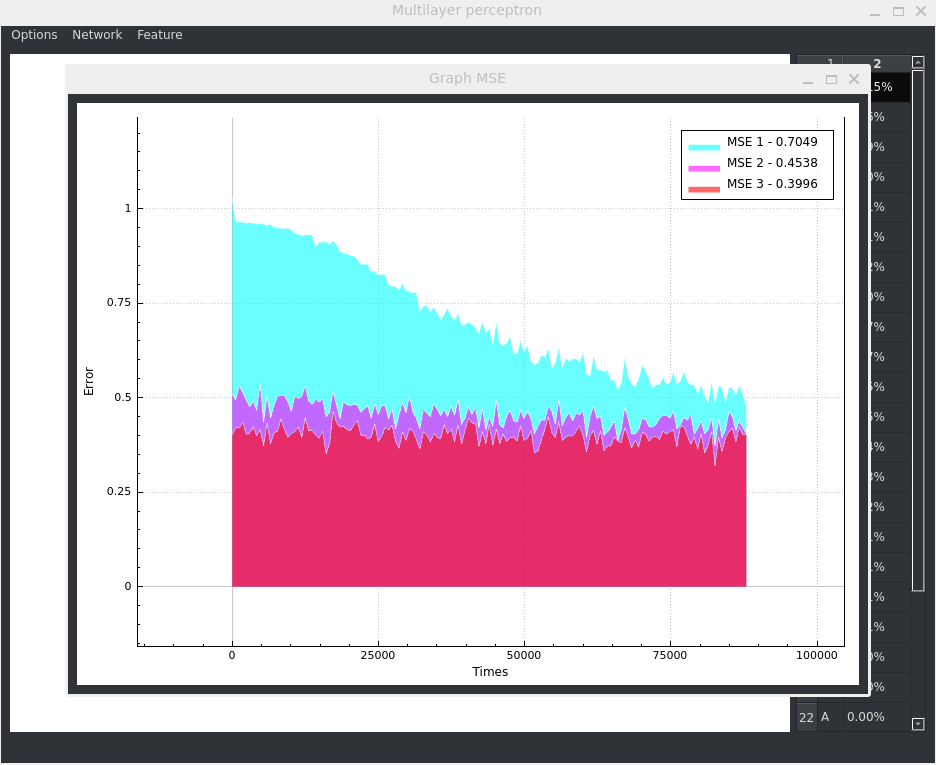
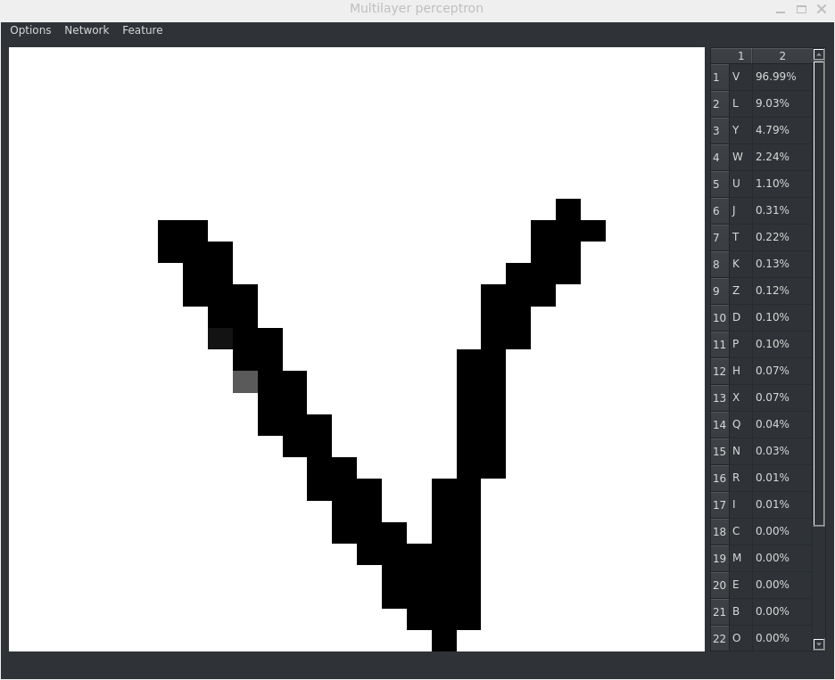
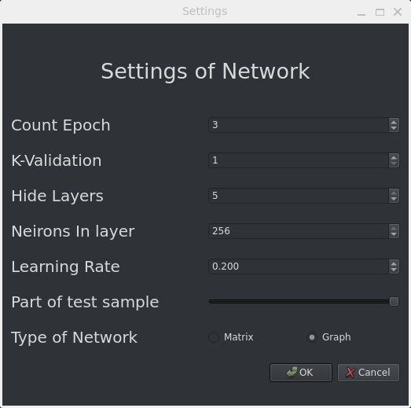
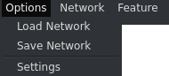
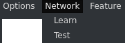
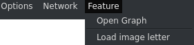

# Распознавание букв английского алфавита с использованием многослойного перцептрона

## Введение

Добро пожаловать в мой проект, где я представляю реализацию многослойного перцептрона ([**MLP**](https://en.wikipedia.org/wiki/Multilayer_perceptron)) для задачи распознавания букв английского алфавита. Мой проект нацелен на создание небольшой программы, которая способна автоматически распознавать символы английского алфавита на основе обучения нейронной сети.

Многослойный перцептрон - это вид искусственной нейронной сети, состоящей из нескольких слоев нейронов. В моем проекте, MLP содержит входной слой, скрытые слои и выходной слой. Входной слой принимает на вход изображения символов, а скрытые слои выполняют вычисления, обрабатывая эту информацию. Выходной слой дает ответ в виде вероятностей того, какой символ был распознан.

Процесс распознавания букв включает в себя несколько этапов:

1. Подготовка данных: Изображения букв английского алфавита преобразуются в числовой формат, чтобы быть понятными для нейронной сети. Мы берем открытые выборки [***EMNIST***](https://www.nist.gov/itl/products-and-services/emnist-dataset)
2. Обучение сети: MLP обучается на наборе обучающих данных, где каждой букве соответствует известная метка. Сеть корректирует свои веса и параметры, чтобы минимизировать ошибку при распознавании. Используется обратное распространение ошибки.
3. Распознавание: После завершения обучения, сеть может использоваться для распознавания символов. Изображение символа подается на вход сети, и она возвращает вероятности для каждой буквы алфавита. Буква с наибольшей вероятностью считается распознанной.

## Работа с приложением

### Загрузка обученных весов перцептрона и проверка распознования

### Настройка и обучение перцептрона

График в конце GIF - это изменение средней квадратичной ошибки на протяжении обучения

### Тестирование обученного перцептрона

Итог - 75% точности угадывания.

### Загрузка фотографий BMP и проверка ответа от перцептрона

## Остальной интерфейс приложения

### Настройки

Интерфейс позволяет настраивать сеть

1. Выбор количества эпох при обучении(1 - 10)
2. К-Валидация при обучении(1 - 5)
3. Количество скрытых слоев(1 - 5)
4. Количество нейронов в скрытом слое(1 - 256)
5. Скорость обучения(0.001 - 10)
6. Часть используемой выборки при тестировании (0% - 100%)
7. Тип перцептрона (Матричный, Графовый)

### Опции

#### Основные

1. Загрузка весов из файла `.net`
2. Сохранение весов в файл `.net`
3. Настройки

#### Сети

1. Обучение перцептрона
2. Тестирование перцептрона

#### Особенности

1. Открыть график средних квадратичных ошибок при обучении
2. Загрузить фотографию для проверки распозновании сети
