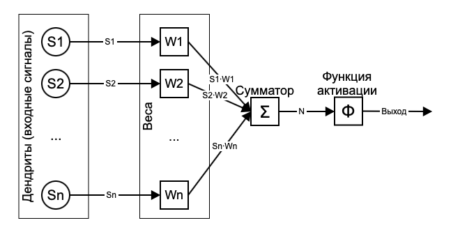
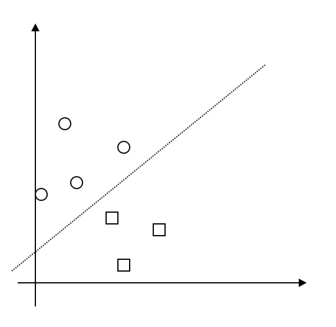
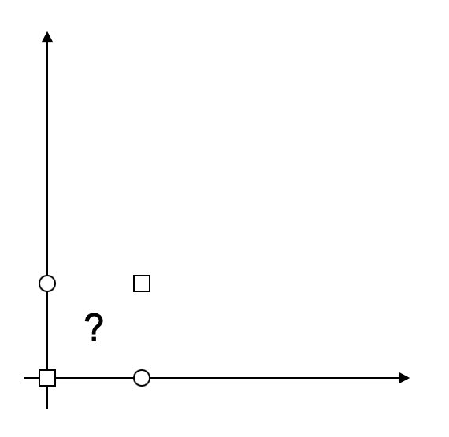
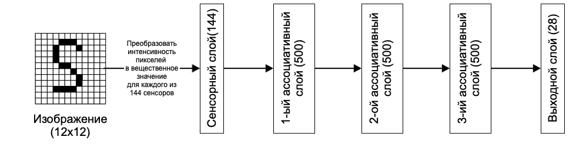

# Perceptron

## Physiological background

Recall that in real life a neuron is a structure consisting of a soma, i.e., a body, and sets of extensions, i.e., axon and dendrites. The dendrites carry signals to the neuron, and the single axon carries signals from the neuron to other neurons. Axon, meanwhile, can have many branches to other neurons. Signal transmission from a neuron via an axon to other neurons is carried out when there is a "spike", i.e. when a certain voltage value across the dendrites is exceeded. Considering different properties of different dendrites, the transmission of signals of different voltages through multiple dendrites gives a huge set of possible neuron states.

## Mathematical background

So, now it's necessary to describe the theoretical model of a neuron, leaving out everything excessive. The most important properties of a neuron remain the input and output, weights associated with the input channels (different properties of dendrites), and some condition under which impulse transmission occurs that is a neuron activation. Thus a neuron can be represented by the following model:

- set of input signals;

- set of real values - weights, which determine how much an input signal affects neuron activation;

- summatory function that adds up all input signals considering the weights;

- activation function, which determines the output of a neuron.

Here it is important to understand that in real life processes are continuous, not discrete. This means that the impulse transmitted by dendrites and axons in real life does not have a square wave structure, that means it does not go from state 0 to state 1 immediately, but does it smoothly, although very quickly. That is why continuous nonlinear functions are used in mathematical description of the impulse change on the neuron channels. The most common choice of **activation function** (this is the name of the functions that determine the signal transmission through the channel) is the sigmoid (logistic) function.

$`f(x) = \frac{1}{1+e^{-x}}`$

This function significantly increases the range of neuron application, as it allows mappings from a continuous interval to a continuous one (instead of from discrete set to discrete). Some function, involving all input signals, should determine the value of the signal output of the neuron. This function is an adder that sums up all dendrite values and compares it to some threshold value, which determines the sigmoid output of the whole neuron. Thus, the neuron can solve some small problem, determined by the sum of the input data and the threshold value, using the received data. It outputs a value between 0 to 1. 0 and 1 can be seen as two different classes, and all values in between are the neuron's guess of how close this configuration of values obtained from the dendrites is to either the first or the second class.

This is the reason why Minsky and Papert criticized the perceptron in 1969. The thing is that this approach allows you to separate the two sets only linearly. In other words, if the perceptron is going to make a choice between 0 and 1 class, its adder threshold is actually some line in the input value space. For example, we have two parameters and some groups of objects that we expect to see in two different classes. The neuron will only work correctly if a straight line can be drawn between these objects on the coordinate plane.

This approach, for example, will not work with XOR gate

Note that in general, a neuron has significantly more than 2 dendrites, and in that case we are talking about a linear division of the hyperspace by a hyperplane.

However, neural networks would be convenient to use as a kind of black box, inputting data and getting a response from the expected set. And since not every task makes it possible to immediately divide classes linearly (and even if it does, then neural networks are most likely useless) and the number of classes can be more than two, neurons are combined into neural networks. Widening neural networks (that is, creating a large number of parallel neurons) allows the network to form a vector of input data in more detail, as well as the dimensionality of the class set. Recall that, like the human brain, neuronal connections are the most valuable, so that networks can be quite densely interconnected up to full connectivity.
By increasing the number of neurons, the number of connections increases accordingly. Parallel unconnected neurons are called layers. Layers are usually divided into several categories:

- A sensor (input) layer that is only meant for transmitting input parameters in a user-friendly quantity. This layer is a buffer between the user's representation of the input data and its intranet representation.

- Multiple hidden layers that recode the input data so that it becomes linearly separable. By increasing the number of hidden layers, the problem of separability is solved, because the input parameters contain simpler dependencies that allow you to translate the input set into a more multidimensional space and divide it much more efficiently.

- An output layer, consisting of the number of neurons equal to the number of output classes. After the network is executed, each of the output neurons generates an output signal, which can be interpreted as a probability of matching the input data to this class.

## An example of a perceptron

Say we need to classify images with handwritten letters of the English alphabet. Generally, we get 26 classes of objects without case. This is the dimensionality of the output layer. The dimensionality of the input layer is determined by the size of the images to be processed (e.g., 12x12=144). Any images can be normalized to this resolution. Pixel intensity values are also to be normalized. After normalizing the values, the network is activated with 144 sensors of the network by transmitting to them the corresponding normalized values of 144 pixels of the current image. After activation of all the hidden layers, an output vector of 26 dimensions is formed, each element of which corresponds to one of the 26 letters of the English alphabet. The element that has the highest value after activation represents the most likely class according to the "opinion" of the network. If the training was successful, after activating the network with the image from the example, the network is likely to prefer the letter "S" (the 19th element if the alphabetical order is maintained).

## Training

Training a network is a process in which the input weights of neurons in associative layers are modified. These values are modified according to some deviation of received output signals of the network from some expected ones. That means that the problem is reduced to the optimization of some network error - bringing it to a minimum. There are many ways to estimate network performance, for example, the sum of distance squares of expected values and actually received values (least square method).

The notion of Rumelhart's perceptron, which is well matched to the multilayer architecture, is closely related to the qualitatively different approach to training such perceptrons from Rosenblatt's one. This is a backpropagation algorithm. Since the error function (e.g. by least squares method) depends on many arguments, i.e. the outputs of all neurons of the network, even intermediate ones, it is a complex function that can be described by some surface in multidimensional space. The optimization problem is to find the minimum on this surface. A neural network initialized with some values of weights represents only some point on this surface, which, in general, is not necessarily optimal at all. To find some minimum on a multidimensional surface, it is suggested to use the gradient descent algorithm. The gradient of the function allows you to get the direction in which this function describing the surface will grow. Thus, in the opposite direction, the surface will decrease. This is the direction we need to move in order to get some minimum of the surface. This way the point iteratively moves with some step guaranteed to go down the hypersurface, since the gradient is recalculated at each step.

Note that there is no exact algorithm for finding the global minimum of such a complex function. This algorithm, guarantees only to find some local minimum, but there are a number of factors that increase the probability of finding a more optimal minimum point. For the most part, this refers to the training parameters of the network - the weights with which the network is initialized and the step at which they change within the network. The step should not be too small as the algorithm will react to the smallest "valley" of the surface and risks staying at the first encountered and very shallow minimum point, but also not too big, because the algorithm can "overshoot" quite deep "valleys". Usually the step size can vary depending on the study of the error value change (like the distance between the obtained and expected values by the least squares method). If the error does not practically decrease during the learning process, most likely it hit a small "fold" on the hypersurface, or, it overshoots all the big "valleys". It is also possible that the weights increase sharply and the learning rate (error reduction) becomes almost equal to zero. Usually it can be handled by manipulating the learning rate.

However, it applies only to the output layer, where the expected value is known precisely. The rest of the layers are modified according to the backpropagation algorithm.

Let:
-$`\eta`$ - learning rate (step)
- $`\delta_i`$ - the error value for the node with index $`i`$
- $`o_i`$ - the output value of the node with index $`i`$
- $`w_{ij}`$ - the weight of the edge connecting the nodes with indexes $`i`$ and $`j`$
- $`Children(j)`$ - a function that returns those nodes for which $`j`$ is the input node (that is, the children of node $`j`$ in the graph representation)

The backpropagation algorithm:

- 1. Initialize the weights $`{w_{ij}}_{ij}`$ with small random values;
- 2. Repeat NUMBER_OF_STEPS times:
    - 2.1. For all d from 1 to m:
        - 2.2.1. Activate the network and get the output values $`o_i`$ for each node
        - 2.2.2. for all $`k \in Outputs`$
            - $`\delta_k = -o_k(1-o_k)(t_k-o_k)`$
        - 2.2.3. for each layer $`l`$ starting from the penultimate
            - for each node $`j`$ in layer $`l`$ calculate
                - $`\delta_j = o_j(1-o_j)\sum_{k \in Children(j)} \delta_k w_{jk}`$
        - 2.2.4. for each edge of the network $`{i,j}`$
            - $`\Delta w_{ij}(n)=\alpha \Delta w_{ij} (n-1) + (1-\alpha)\eta \delta_j o_i`$
            - $`w_{ij}(n) = w_{ij}(n-1) - \Delta w_{ij}(n)`$,

where $`\alpha`$ is the inertia coefficient to smooth out sharp overshoots as you move across the surface of the objective function.

The learning itself is usually performed in **epochs** on a large representative sample. The sample is divided into two parts: test and training (for example, in the ratio of 1:9 or 2:8). Learning on the test sample is not carried out, it is necessary for an objective assessment of the network on the data, which the network has never "seen". Learning is performed by running the elements of the training sample by shuffle. One run of a training sample is usually considered as one epoch of learning.
The number of epochs needed for learning varies with the specific task and sample. If the step is successfully chosen, you will already see the error reduction after the first epoch. It is important to understand that any sample is a finite set and contains "noise" apart from useful information. So having the network train too long on the same sample, even if using shuffle, will increase the sensitivity of the network to the stochastic noise of the sample instances, which is not the objective. All these factors lead to the phenomenon that happens very often during "retraining" of the network, when after some epoch the error size on the test sample starts to gradually increase. That is an obvious indicator that the sample has exhausted itself and further training on the same sample is pointless.
