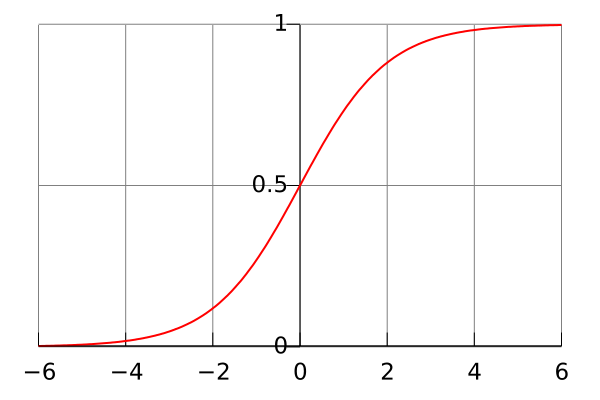
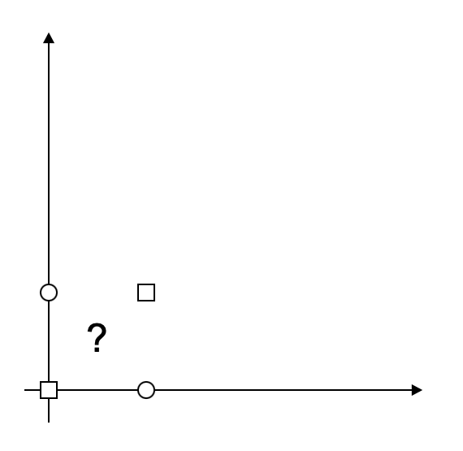

# Перцептрон

## Физиологические предпосылки

Напомним, что в реальной жизни нейрон - это структура, состоящая в общем из сомы - тела, и наборов отростков: аксона и дендритов. По дендритам осуществляется передача сигналов в нейрон, а по единственному аксону - передача сигнала из нейрона в другие нейроны. Аксон при этом, может иметь множество отростков к другим нейронам. Передача сигнала от нейрона по аксону к другим нейронам осуществляется при "спайке", то есть превышении некоторого значения напряжения, подаваемого по дендритам. Учитывая различные свойства разных дендритов, передача сигналов различного напряжения через множество дендритов дает объемное пространство возможных состояний нейрона.

## Математические предпосылки

Итак, теперь необходимо описать теоретическую модель нейрона, отбросив все лишнее. Наиболее важными свойствами нейрона остаются входные и выходной каналы, веса, связанные с входными каналами (различные свойства дендритов), и некоторое условие, при котором происходит передача импульса - активация нейрона. Таким образом нейрон можно представить следующей моделью:

- множество входных сигналов;

- множество вещественных значений - весов, которые определяют насколько тот или иной входной сигнал влияет на активацию нейрона;

- сумматорная функция, складывающая все входные сигналы с учетом весов;

- функция активации, определяющая выход нейрона.

Тут важно понимать, что в реальной жизни процессы являются непрерывными, а не дискретными. Это означает, что импульс, передаваемый по дендритам и аксонам, в реальной жизни имеет не прямоугольную ступенчатую структуру, то есть не переходит из состояния 0 в состояние 1 сразу, а делает это плавно, хоть и очень быстро. Поэтому в математическом описании изменения импульса на каналах нейрона используют непрерывные нелинейные функции. Наиболее распространенным выбором **функции активации** (именно так называются функции, определяющие передачу сигнала по каналу) является сигмоидальная (логистическая) функция.

$`f(x) = \frac{1}{1+e^{-x}}`$

Такая функция значительно увеличивает спектр применения нейронов, так как позволяет производить отображения из непрерывного интервала в непрерывный (а не из дискретного множества в дискретное). Определить значение выдаваемого на выход нейрона сигнала должна некоторая функция, задействующая все входные сигналы. Такой функцией является обычный сумматор, складывающий все значения дендритов и сравнивающий его с некоторым пороговым значением, которое и определяет сигмоидный выход всего нейрона. Таким образом нейрон, на основании полученных данных, может решать некоторую небольшую задачу, определяемую суммой входных данных и пороговым значением. На выходе он выдает значение от 0 до 1. 0 и 1 можно рассматривать как два различных класса, а все значения между ними - предположением нейрона о том, насколько близка такая конфигурация значений, полученных из дендритов, к первому или второму классу. Именно с этим моментом и связана критика перцептрона Минским и Папертом в 1969 году. Дело в том, что такой подход позволяет разделить два множество лишь линейно. То есть если перцептрон собирается сделать выбор между 0 и 1 классом, то его пороговое значение сумматора на самом деле представляет собой некоторую линию в пространстве входных значений. Например,, у нас есть два параметра и некоторые группы объектов, которые мы ожидаем увидеть в двух разных классах. Нейрон отработает корректно только в том случае, если на координатной плоскости с этими объектами можно провести прямую линию между ними.

Такой подход, например, не сработает с логическим выражением XOR

Обращаем внимание, что в общем случае, у нейрона значительно больше чем 2 дендрита, и тогда речь идет о линейном разделение гиперпространства гиперплоскостью.

Однако нейронные сети было бы удобно использовать как своего рода черный ящик, подавая на вход данные и получая ответ из ожидаемого множества. А так как далеко не каждая задача представляет возможность с ходу разделить линейно классы (а даже если и позволяет, тогда и нейронные сети скорее всего ни к чему) и количество классов может быть больше двух, нейроны объединяют в нейронные сети. Увеличивая нейронные сети в ширину (то есть, создавая большое количество параллельных нейронов), сеть позволяет более подробно формировать вектор входных данных, а так же размерность множества классов. Напоминаем, что аналогично человеческому мозгу, наибольшую ценность представляют связи нейронов, так что сети могут быть достаточно плотно связаны вплоть до полносвязных. Увеличивая количество нейронов соответственно и увеличивается количество связей. Параллельные несвязанные между собой нейроны называются слоем. Слои принято разделять на несколько категорий:

- Сенсорный слой, исключительно предназначенный для передачи входных параметров в удобном для пользователя количестве. Этот слой является буфером между пользовательским представлением о входных данных и их внутрисетевым представлением.

- Множество скрытых слоев, осуществляющих перекодирование входных данных таким образом, чтобы они стали линейно разделимыми. Именно за счет увеличения количества скрытых слоев осуществляется решение проблемы о разделимости, так как во входных параметрах находятся более простые зависимости, позволяющие перевести входное множество в более многомерное пространство и разделить его намного более удачно.

- Выходной слой, состоящий из числа нейронов, равного числу выходных классов. После срабатывания сети в каждом из выходных нейронов формируется выходной сигнал, который можно трактовать как вероятность соответствия входных данных этому классу.

## Пример перцептрона

Пусть нам необходимо классифицировать изображения с рукописными буквами английского алфавита. В общем случае без учета регистра мы получаем 26 классов объектов. Это и есть размерность выходного слоя. Размерность входного слоя обусловлена размером обрабатываемых изображений (например, 12x12=144). Любые изображения можно нормировать к этому разрешению. Нормировке так же подлежат и значения интенсивности пикселей. После нормировки значений производится активация сети соответствующими значениями 144 сенсоров сети путем передачи им соответствующих нормированных значений 144 пикселей текущего изображения. После активации всех скрытых слоев формируется выходной вектор размерностью 26, каждый из элементов которого соответствует одной из 26 букв английского алфавита. Тот элемент, который после активации имеет наибольшее значение, отображает наиболее вероятный класс по "мнению" сети. Если обучение было проведено удачно, после активации сети изображением из примера сеть скорее всего отдаст предпочтение букве "S" (19 элемент при сохранении алфавитного порядка).

## Обучение

Обучение сети - это процесс, при котором происходит модификация весовых значений входных сигналов нейронов ассоциативных слоев. Модифицируются эти значения согласно некоторому отклонению полученных выходных сигналов сети от некоторых ожидаемых. То есть задача сводится к оптимизации некоторой ошибки сети - сведению ее к минимуму. Существует множество способов оценки работы сети, например, сумма квадратов расстояний ожидаемых значений и фактически полученных (метод наименьших квадратов).

С понятием перцептрона Румельхарта тесно связан качественно отличающийся от предлагаемого Розенблаттом подход к обучению таких перцептронов, хорошо подходящий для многослойной архитектуры. Это алгоритм обратного распространения ошибки. Так как функция ошибки (например по методу наименьших квадратов) зависит от множества аргументов, то есть, от выходов всех нейронов сети, даже промежуточных, то она представляет собой сложную функцию, которую можно описать некоторой поверхностью в многомерном пространстве. Задача оптимизации сводится к нахождению минимума на этой поверхности. Инициализированная некоторыми значениями весов нейронная сеть представляет собой лишь некоторую точку на этой поверхности, которая, в общем случае, совсем не обязательно является оптимальной. Для нахождения некоторого минимума на многомерной поверхности предлагается использовать алгоритм градиентного спуска. Градиент функции позволяет получить направление, в котором данная функция, описывающая поверхность, будет расти. Соответственно в обратном направлении поверхность будет убывать. В этом направлении и необходимо двигаться, чтобы получить некоторый минимум поверхности. Таким образом точка итеративно двигается с некоторым шагом гарантированно спускаясь вниз по гиперповерхности, так как пересчет градиента происходит на каждом шаге.

Стоит отметить, что четкого алгоритма нахождения глобального минимума такой сложной функции не существует. Данный алгоритм, гарантирует лишь нахождение некоторого локального минимума, но есть целый ряд соображений, который позволяет увеличить вероятность нахождения более оптимальной точки минимума. В большинстве своем, это касается параметров обучения сети - весовых значений, которыми инициализируются сеть, и шага, с которым они меняются внутри сети. Шаг не должен быть слишком маленьким, тогда алгоритм будет реагировать на самые маленькие "впадины" поверхности и рискует остается в первой встречной и очень неглубокой точке минимума, но и не слишком большим, так как алгоритм может "перескочить" достаточно глубокие "впадины". Обычно размер шага может меняться в зависимости от исследования изменения значения ошибки (как, например, расстояния между полученными и ожидаемыми значениями по методу наименьших квадратов). Если ошибка практически не уменьшается в процессе обучения, скорее всего она попала в маленькую "складку" на гиперповерхности, или же, перескакивает через все большие "впадины". Так же возможна ситуация, при которых резко возрастают значения весов и темп обучения (уменьшения значения ошибки) практически становится равным нулю, это явление называется "параличом сети". Обычно "паралич сети" также решается манипуляциями над шагом обучения.

Однако данные соображения применимы лишь к выходному слою, где точно известно ожидаемое значение. Модификация остальных слоев производится согласно алгоритму обратного распространения ошибки.

Пусть:
- $`\eta`$ - скорость движения (шаг)
- $`\delta_i`$ - значение ошибки для узла с индексом $`i`$
- $`o_i`$ - выходное значение узла с индексом $`i`$
- $`w_{ij}`$ - вес ребра, соединяющего узлы с индексами $`i`$ и $`j`$
- $`Children(j)`$ - функция, возвращающая те узлы, для которых узел $`j`$ является входным (то есть потомков узла $`j`$ в графовом представлении)

Алгоритм обратного распространения ошибки:

- 1. Инициализировать веса $`{w_{ij}}_{ij}`$ маленькими случайными значениями;
- 2. Повторить NUMBER_OF_STEPS раз:
    - 2.1. Для всех d от 1 до m:
        - 2.2.1. Выполнить активацию сети и получить выходные значения $`o_i`$ для каждого узла
        - 2.2.2. для всех $`k \in Outputs`$
            - $`\delta_k = -o_k(1-o_k)(t_k-o_k)`$
        - 2.2.3. для каждого слоя $`l`$ начиная с предпоследнего
            - для каждого узла $`j`$ в слое $`l`$ вычислить
                - $`\delta_j = o_j(1-o_j)\sum_{k \in Children(j)} \delta_k w_{jk}`$
        - 2.2.4.для каждого ребра сети $`{i,j}`$
            - $`\Delta w_{ij}(n)=\alpha \Delta w_{ij} (n-1) + (1-\alpha)\eta \delta_j o_i`$
            - $`w_{ij}(n) = w_{ij}(n-1) - \Delta w_{ij}(n)`$,

где $`\alpha`$ - коэффициент инерциальности для сглаживания резких скачков при перемещении по поверхности целевой функции.

Само обучение обычно выполняется **эпохами** на большой репрезентативной выборке. Выборку разделяют на две части: тестовая и обучающая (например, в соотношении 1:9 или 2:8). Обучение на тестовой выборке не проводят, она необходима для объективной оценки работы сети на данных, которые сеть никогда "не видела". Обучение производится через прогон элементов обучающей выборки в случайном порядке (шафл). Один прогон обучающей выборки обычно воспринимается как одна эпоха обучения. Количество эпох, необходимых для обучения, варьируется от конкретной задачи и выборки. При удачном подборе шага уже после первой эпохи будет заметен спад ошибки. Важно понимать, что любая выборка является конечным множеством и помимо полезной информации содержит в себе "шумы". Таким образом слишком долгое обучение сети на одной и той же выборке, пусть и с применением шафла, приведет к повышению чувствительности сети к стохастическим шумам экземпляров выборки, что не является целевой задачей. Все эти соображения выливаются в явление, которое происходит очень часто при "переобучении" сети, когда после некоторой эпохи размер ошибки на тестовой выборке начинает постепенно увеличиваться. Такое событие - явный индикатор того, что выборка исчерпала себя и дальнейшее обучение на той же самой выборке бессмысленно. 
