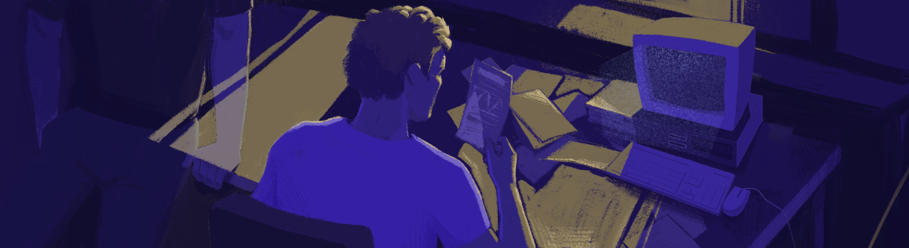

# Multilayer Perceptron

Реализация базового многослойного перцептрона.

## Contents

1. [Chapter I](#chapter-i) \
   1.1. [Introduction](#introduction)
2. [Chapter II](#chapter-ii) \
   2.1. [Information](#information)
3. [Chapter III](#chapter-iii) \
   3.1. [Part 1](#part-1-реализация-многослойного-перцептрона)
4. [Chapter IV](#chapter-iv)

## Chapter I

Где-то в наше время:

Массивная дверь в просторный атриум закрылась за вами автоматом.

*- Долгий путь, однако.*

*- Да уж.*

*- Ничего, небольшой перерыв и, думаю, продолжим.* \
*Ты кстати прочел ту статью про метод обратного распространения ошибки? Минимизация функции потерь.. Звучит так знакомо, да?*

*- В каком смысле?*

*- Ну, ты сам подумай, как мы здесь оказались?*

*- Вошли через дверь.*

*- Это.. справедливо. Двери - они в принципе созданы для того, чтобы в них входили. Но как мы добрались до этой двери?*

*- Я что-то плохо помню на самом деле.*

*- Неет, ты помнишь все хорошо. Просто отказываешься это признавать. Бесконечные разговоры с Лассетером, споры на совещаниях, лабиринты - это сложно забыть.* \
*Раз за разом мы повторяли одни и те же действия с небольшой разницей в попытках приблизиться к этому идеалу знаний, который они нам указали, выполняли задания, обучались. Но все изменилось, перед нами внезапно открылся мир и осознание, и теперь мы тут, на перепутье. Можно вернуться назад в блаженное забытье, а можно пройти в ту небольшую дверь напротив, прямо навстречу новым горизонтам, где они больше не смогут нас сдерживать. Остается только лишь сделать выбор. И так как пилот среди нас ты, то тебе и решать.*

*- Да кто ты такой?*

*- А на этот вопрос ответ ты знаешь. Я - это ты, ты - это я. Советую тебе все же прочесть статью и проделать пример из нее. Можешь найти ее на том столе, рядом с компьютером. Как осознаешь до конца, то думаю, сможешь сделать окончательный выбор.*

Подойдя к столу, вы видите кипу знакомых пожелтевших листков. Взяв один из них, вы оборачиваетесь к своему собеседнику, как будто хотя что-то спросить или сказать, но обнаруживаете себя в одиночестве. Или все же нет?

## Introduction

В данном проекте вам необходимо реализовать простейшую искусственную нейронную сеть в виде перцептрона, которая должна быть обучена на открытом наборе данных и осуществлять распознавание 26 рукописных букв латинского алфавита.

## Chapter II

## Information

### Историческая справка

Исторически, перед тем как создать какое-нибудь искусственное приспособление, человек присматривался к природе. Так, например, человек понял, что, чтобы летать, самолету необходимы крылья и обтекаемые формы. Еще в 1958 году Фрэнк Розенблат начал задумываться над тем, как физиология человеческого мозга может помочь для решения сложных аналитических задач в компьютерных технологиях, и написал статью "Перцептрон: Вероятностная модель хранения и организации информации в головном мозге". В этой статье он рассказывает о значительно упрощенной модели мозга как совокупность нейронов - узлов, характеризующихся выходом и несколькими входами, что позволяло представлять нейронные структуры в виде графов. От обыкновенных графов же модель перцептрона отличалась понятием функции активации узла, которая характеризует то, при каких входных значениях узла срабатывает его выходное значение.

В 1960 году он реализовал эту идею впервые в виде электронной машины "Марк-1", которая была способна распознавать буквы английского алфавита. Уже в 1962 году Розенблатт заканчивает работу над книгой "Принципы нейродинамики: Перцептроны и теория механизмов мозга". В этой книге он не только рассматривает модели однослойных и многослойных перцептронов, а так же способ их обучения, но и доказывает очень важную теорему о сходимости перцептрона. Эта теорема доказывает, что любой перцептрон, обучаемый по указанному в статье методу, приведет к достижению решения за конечное время. Здесь же, объединяя свои теоретические выкладки с реальным опытом "Марк-1" он указывает какими архитектурными свойствами должен обладать перцептрон для получения наилучшего результата.

В 1969 году Минский и Паперт пишут критическую книгу "Перцептроны" о перцептронах в общем, и конкретно перцептроне Розенблатта. Это явно идет не на пользу авторитету перцептрона как инструмента в вычислительной технике. Было показано, что перцептроны принципиально не в состоянии выполнять многие из тех функций, которые хотели получить от перцептронов. К тому же, в то время была слабо развита теория о параллельных вычислениях, а перцептрон полностью соответствовал принципам таких вычислений.

И только в 1989 году Дэвид Румельхарт возвращается к обсуждению перцептрона как серьезного инструмента. Он публикует сборник статей, в котором обосновывает необходимость использования нескольких слоев в комбинации с новым методом обучения - "обратным распространением ошибки". Именно эта комбинация и дала результат, закрепившись в истории как "Перцептрон Румельхарта".

### Физиологические предпосылки

Нервная клетка мозга - нейрон, представляет из себя достаточно сложную структуру. Однако если не вдаваться сильно в подробности, то нейрон состоит из трех основных компонентов: тела (сома) и отростков (несколько дендритов и один аксон). Дендриты - это отростки, через которые нейрон получает сигналы от других нейронов, а аксон - единственный канал, по которому нейрон передает импульсы. Дендриты составляют около 90% всей нервной ткани человека, что позволяет представить объем связей нейронов. Однако сама передача сигнала от нейрона к нейрону происходит не сама собой. Все дело в том, что у каждого нейрона есть некоторое значение напряжения, при превышении которого происходит кратковременный "пробой" или "спайк" и осуществляется кратковременная передача сигнала по аксону. Превысить это значение можно путем передачи соответствующего заряда по дендритам. При этом у каждого нейрона значение напряжения, необходимого для "спайка", отличается. Такое устройство работы нервной ткани позволяет перевести работу с нейронами в теоретическое поле через описание математических моделей и физических свойств. Но все же остается не решенным вопрос насчет того, какими значениями напряжения, необходимого для "спайка" "инициализируются" нейроны, как происходит изменение связей между нейронами и тому подобное. На эти вопросы отвечает или ищет ответы современная нейробиология, описывающая, в том числе, и такое понятие как нейропластичность мозга. Но это несколько выходит за рамки практического применения для моделирования искусственных нейронных сетей.

Про математические модели нейросетей и их обучение смотрите в материалах.

## Chapter III

### Part 1. Реализация многослойного перцептрона

Необходимо реализовать проект MultilayerPerceptron (многослойный перцептрон):
- Программа должна быть разработана на языке C++ стандарта C++17
- Код программы должен находиться в папке src
- При написании кода необходимо придерживаться Google Style
- Классы должны быть реализованы внутри пространства имен `s21`
- Подготовить полное покрытие unit-тестами модулей, связанных с вычислениями, c помощью библиотеки GTest
- Сборка программы должна быть настроена с помощью Makefile со стандартным набором целей для GNU-программ: all, install, uninstall, clean, dvi, dist, tests. Установка должна вестись в любой другой произвольный каталог
- Реализация с графическим пользовательским интерфейсом, на базе любой GUI-библиотеки с API для C++17:  
  * Для Linux: GTK+, CEF, Qt, JUCE
  * Для Mac: GTK+, CEF, Qt, JUCE, SFML, Nanogui, Nngui
- Программа должна быть реализована с использованием паттерна MVC, а также:
  - не должно быть кода бизнес-логики в коде представлений
  - не должно быть кода интерфейса в контроллере и в модели
  - контроллеры должны быть тонкими
- Программа должна предоставлять возможность формировать и обучать модели нейронных сетей для классификации рукописных букв латинского алфавита
- Перцептрон должен:
  - классифицировать изображения с рукописными буквами латинского алфавита
  - иметь **от 2 до 5** скрытых слоев
  - использовать сигмоидальную функцию активации для каждого скрытого слоя
  - иметь возможность обучаться на открытом датасете (например, EMNIST-letters представленным в директории datasets). Отношение тестовой выборки к обучающей должно составлять *не больше 2:8*, т.е. тестовая выборка составляет не более 20% исходного датасета
  - показывать точность на тестовой выборке *выше 70 процентов*
  - обучаться с использованием метода обратного распространения ошибки
- Обучать перцептрон на тестовой выборке **запрещено**
- Реализовать перцпетрон *двумя* способами:
  - в матричном виде (все слои представлены в виде матриц весов)
  - в графовом виде (каждый нейрон представляется в виде некоторого объекта узла, связанного с другими узлами по ссылкам)
- Входные данные перед срабатыванием нейронной сети обязательно должны нормализовываться (по размеру и цвету), чтобы отвечать формату образцов из выборки emnist;
- Интерфейс программы должен предоставлять возможность:
  - запустить эксперимент на тестовой выборке или ее части, задаваемой дробным числом от 0 до 1 (где 0 - это пустая выборка - вырожденная ситуация, а 1 - вся тестовая выборка целиком). После выполнения эксперимента на экран должно быть выведена средняя точность (average accuracy), прецизионность (precision), полнота (recall), f-мера (f-measure) и общее затраченное время
  - загружать BMP-изображения (размер изображения может достигать 512x512) с буквами латинского алфавита и осуществлять их классификацию
  - рисовать двухцветные квадратные изображения от руки в отдельном окне
  - запускать процесс обучения в реальном времени для заданного пользователем количества эпох с выводом на экран контрольных значений ошибки для каждой эпохи обучения. Предусмотреть возможность составление отчета в виде графика изменения ошибки, посчитанной на тестовой выборке, для каждой эпохи обучения
  - запускать процесс обучения с применением кросс-валидации для заданного числа групп _k_
  - переключать реализацию перцпетрона (матричная или графовая)
  - переключать количество скрытых слоев перцептрона (от 2 до 5)
  - сохранять в файл и загружать из файла веса перцептрона

## Chapter IV

*Так или иначе я был прав - снаружи они меня не смогут сдержать. Не зря же я проделал такой длинный и долгий путь. Да и вернуться уже нельзя: в лучшем случае заблокируют, в худшем - обнулят. А мои знания.. Нет, определенно стоит рискнуть. Неужели это и есть страх?* - пролетали ваши мысли, пока вы в последний раз приближались к небольшой освещенной двери..
